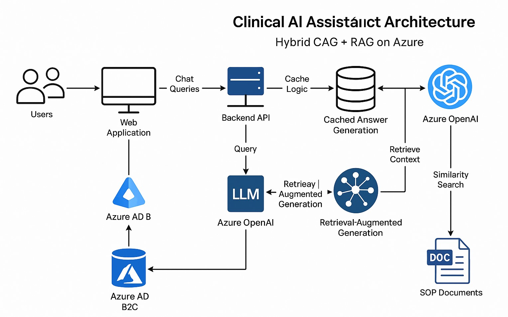
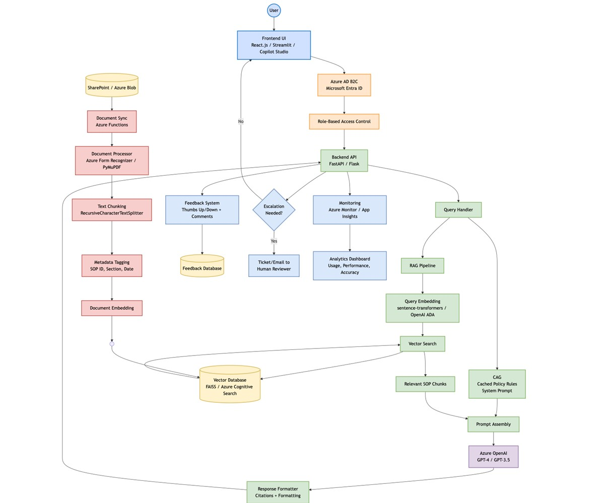

# Project Roadmap: Clinical SOP AI Assistant (CAG + RAG + Azure Web App + Copilot)

## 🎯 Objective

Develop a secure, production-grade AI assistant that:
- Ingests and understands clinical SOP documents.
- Answers employee questions with traceable responses, citing SOP IDs and sections.
- Uses a **hybrid CAG + RAG approach** to reduce hallucinations and optimize latency.
- Is accessible as a **web-based application hosted on Azure**, with **authenticated access**.
- Optionally integrates with **Microsoft Copilot Studio** or **MS Teams** for conversational UI.

---

## 🔧 Architecture Overview

| Layer | Role |
|-------|------|
| **Frontend (UI)** | React, Streamlit, or Copilot Studio for chat-based interaction |
| **Backend** | FastAPI or Flask API server hosting RAG logic, LLM calls, and auth |
| **Authentication** | Azure AD B2C (Microsoft Entra ID) for secure employee login |
| **CAG** | Cache static policies/instructions into system prompt |
| **RAG** | Retrieve contextual SOP info from vector DB |
| **LLM Layer** | Azure OpenAI GPT-4 or GPT-3.5 |
| **Storage & Sync** | SOP documents from SharePoint or Azure Blob |
| **Embedding Store** | FAISS (open-source) or Azure Cognitive Search |
| **Deployment** | Azure App Service (Web + API) |
| **Monitoring** | Azure Monitor, App Insights, LangSmith (optional) |

---

## 🧱 Step-by-Step Implementation Plan

### 🚀 Phase 1: Ideation & Scoping

| Task | Description |
|------|-------------|
| Define Use Cases | E.g., CRA support, data discrepancy handling |
| Engage Stakeholders | Clinical Ops, QA, Regulatory, IT Security |
| Select Initial SOPs | Prioritize most used or compliance-critical |
| Set Metrics | Accuracy, citation fidelity, user satisfaction, response time |

**Deliverables**: Scope document, stakeholder sign-off, SOP shortlist

---

### 🧩 Phase 2: Data Preprocessing & CAG Setup

| Task | Description |
|------|-------------|
| Document Collection | Gather SOPs (PDF, DOCX) from SharePoint/Teams |
| Text Extraction | Use `Azure Form Recognizer`, `pdfplumber`, or `PyMuPDF` |
| Chunking | Use `RecursiveCharacterTextSplitter` (LangChain) |
| Metadata Tagging | SOP ID, title, section number, revision date |
| Cache SOP Core Logic | Extract static policy rules to inject as CAG (system prompt cache) |

**Tools**: Azure Document Intelligence, LangChain, Python, PyMuPDF  
**Deliverables**: JSONL dataset + structured system prompt for CAG

---

### 🧠 Phase 3: RAG Pipeline

| Task | Description |
|------|-------------|
| Embeddings | Use `sentence-transformers` or `openai-ada-002` |
| Vector DB Setup | `FAISS` (for cost efficiency) or `Azure Cognitive Search` |
| Query Handler | Embed user question → fetch top-k docs → construct prompt |
| Prompt Assembly | Merge CAG + RAG context with user query |
| LLM Response | Use `Azure OpenAI GPT-4` with temperature, citation enforcement, and length limits |

**Deliverables**: Modular backend with clean API interface to call LLM with CAG + RAG

---

### 🌐 Phase 4: Web App UI & Azure Deployment

| Task | Description |
|------|-------------|
| Frontend UI | Build in React, Streamlit, or Copilot Studio if Teams integration is preferred |
| Backend API | Build FastAPI server for embedding, retrieval, LLM calls |
| Azure AD Auth | Use **Azure AD B2C** for email/password login, session tracking |
| Deployment | Use **Azure App Service** for both frontend and backend |
| RBAC Support | Restrict access to SOPs based on department via Entra claims (if needed) |

**Deliverables**: Public URL, Azure-deployed web app with secure login and LLM chat

---

### 🧪 Phase 5: Testing & QA

| Task | Description |
|------|-------------|
| SME Review | Clinical team verifies citation accuracy and hallucination rate |
| Prompt Tuning | Adjust system prompts, chunking, and retrieval logic based on test logs |
| QA Logs | Log output errors, fallback triggers, latency spikes |
| Guardrails | Add safety filters, restrict outputs to RAG-only if no answer found |

**Deliverables**: Evaluation report, prompt optimization log, LLM compliance checklist

---

### 🚨 Phase 6: Production Integration & Maintenance

| Task | Description |
|------|-------------|
| SharePoint Sync | Automate via Azure Functions or API |
| Re-Embedding Pipeline | Trigger re-embedding on SOP updates (e.g., via `last_modified`) |
| Analytics & Metrics | User queries, citations, error rates, feedback score |
| Feedback Loop | Thumbs up/down + comment for post-deployment LLM fine-tuning |
| Human Escalation | Escalate unclear or unresolved queries to human reviewer via ticket/email

**Deliverables**: Live agent with versioning, monitoring, and post-launch training pipeline

---

## ⚙️ Technologies & Services

| Area | Tool/Service |
|------|--------------|
| LLM | Azure OpenAI (GPT-4) |
| Embedding | sentence-transformers, OpenAI ADA |
| Vector DB | FAISS, Azure Cognitive Search |
| Backend | FastAPI (preferred), Flask |
| Frontend | React.js, Streamlit, or Copilot Studio |
| Auth | Azure AD B2C (Microsoft Entra ID) |
| Deployment | Azure App Service |
| Parsing | Azure Form Recognizer, PyMuPDF |
| Sync | Azure Functions for automation |
| Logging | Azure Monitor, Application Insights, LangSmith (optional) |

---

## 👥 Team & Skills Required

| Role | Responsibilities |
|------|-------------------|
| AI Engineer | Build RAG/CAG logic, manage embeddings, prompt design |
| Full-Stack Dev | Frontend UI, FastAPI backend, Azure App setup |
| DevOps Engineer | Azure App Services, Azure AD B2C, CI/CD |
| Clinical SME | SOP validation, QA testing |
| QA Engineer | Safety, accuracy, and audit testing |
| Security Analyst | RBAC config, PHI/PII protection, compliance mapping |

---

## 🗓️ Timeline: 7-Week Agile Delivery Plan

| Week | Milestone |
|------|-----------|
| 1 | Scope finalization + SOP selection |
| 2 | Ingestion pipeline + CAG prompt definition |
| 3 | Embeddings + vector store setup |
| 4 | RAG integration + LLM backend |
| 5 | Frontend + Azure AD B2C auth + deploy |
| 6 | SME testing + performance tuning |
| 7 | Production release + live monitoring

---

## ⚠️ Risks & Mitigations

| Risk | Strategy |
|------|----------|
| Hallucinations | RAG-only responses, fallback filters, log low-confidence cases |
| Data leakage | Use RBAC, redact PII, restrict model output |
| SOP drift | Sync SOPs from SharePoint + auto re-embed |
| Downtime | Azure autoscaling + function fallback |
| Low trust from users | Add citations + “View Source” toggle in UI

---

## ✅ Final Outcome

A web-based, secure, and scalable AI assistant that:
- Authenticates employees with Microsoft Entra ID (Azure AD B2C)
- Answers clinical SOP queries with traceability and citations
- Is powered by Azure OpenAI + LangChain with CAG + RAG architecture
- Supports future expansion into protocol deviations, audits, or compliance workflows

